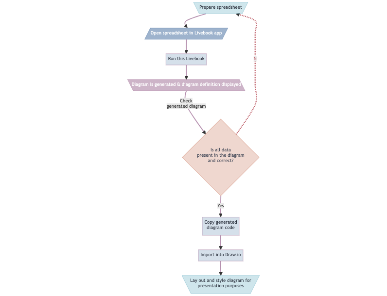

# Peer Map Generator

Generate [Mermaid](https://mermaid.js.org/) flowchart-based diagrams from data
defined in spreadsheets.

## Overview

Contextual safeguarding practitioners have incomplete data on teenagers at risk
of harm. Through working with numerous external agencies, data on individuals is
collected and combined. By making this data visual, certain patterns—of gang
violence, exploitation, trafficking and slavery, amongst other risks—can become
apparent and actionable. 

This generator ingests carefully-formatted spreadsheets, creating
[Mermaid](https://mermaid.js.org/) flowchart-based peer maps.

## Detailed description

Peer mapping is used as a visual tool, helping to support—and itentify those
needing support—young people affected by _extra-familiar harm_ (Peace et al.,
2022). While it's straightforward to simply build a diagram directly in a
diagramming program, it can be slow and error-prone to copy and paste the names,
ages and often involved actions of all the individuals involved. Instead, as
much of this data already exists in spreadsheets, it is easier and less
error-prone to create a _good-enough_ diagram from that data, as a feedback and
prototyping first step. This diagram provides a quick visualisation of the data,
so that practitioners can check that all information is complete at this stage.

Mermaid is used as a tool in this process, as it opens up the functionality to
programmatically take in data to be presented, and, using sophisticated algorithms,
automatically lay out that data. Usually, this data is complex and Mermaid is
unable to lay out diagrams in a way that helps practitioners infer patterns,
which is a job for the next step.

With the automatically generated diagram, this tool-a simple web app-also
exposes the code defining the diagram, which can then be imported into a
dedicated diagramming software. By importing this code into software such as
[Draw.io](https://www.drawio.com/), the practitioner can aesthetically format
the automatic first diagram with the agency's preferred colour scheme,
established use of symbols, shapes and relationships, into an informative and
presentable diagram. At this stage it is laid out in just such a way to make it
easier to recognise relevant patterns, quickly identifying teenagers most at
risk, in need of intervention.

The ingestion, conversion and Mermaid diagram code generation is done inside
this Livebook. Click on the button below to import the Livebook to your local
instance, to read detailed documentation, inspect and run the code and generate
diagrams.

The process is summarised in the following figure, describing all the steps.

## Features

## Setup & Installation

## Usage & Details

## ChangeLog & Roadmap

## References

* Peace, D., Notarianni, M., & Latimer, K. (2022). Peer mapping case studies and examples. University of Bedfordshire. https://www.contextualsafeguarding.org.uk/media/cbwawfmj/peer-mapping-examples.pdf
* Osinde, D. (2022). Reflections on using the peer assessment tool in child and family assessments. London Borough of Barking & Dagenham. https://www.contextualsafeguarding.org.uk/media/ir0hqxhy/5g-practitioner-perspectives-level-1.pdf

